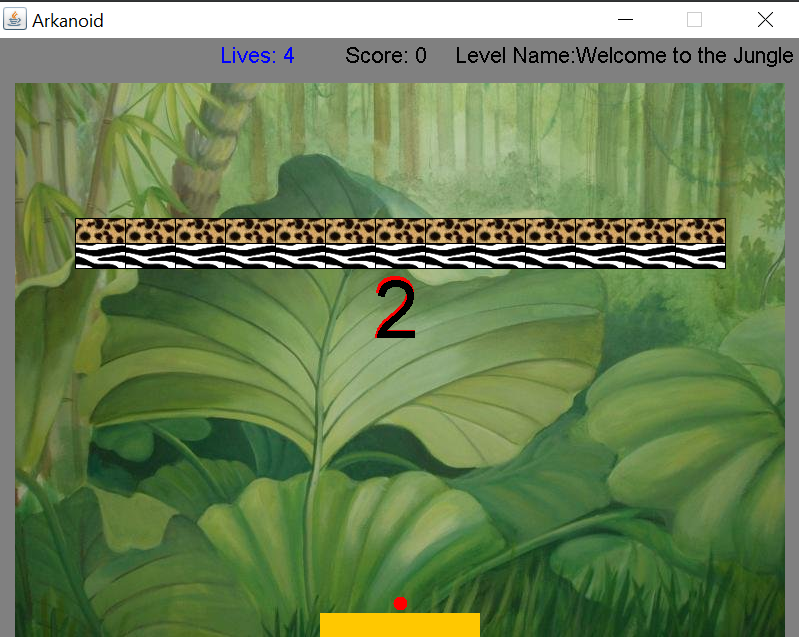

# Arkanoid

Written in Java as part of a first-year OOP course at Bar-Ilan University.

There are three difficulty levels: easy, medium, and hard.

Every stage of the game has four levels.

For each block that you hit, you will receive 10 points.

Every round will give you bonus points.

**How to run it?** just run the Arkanoid.jar file

